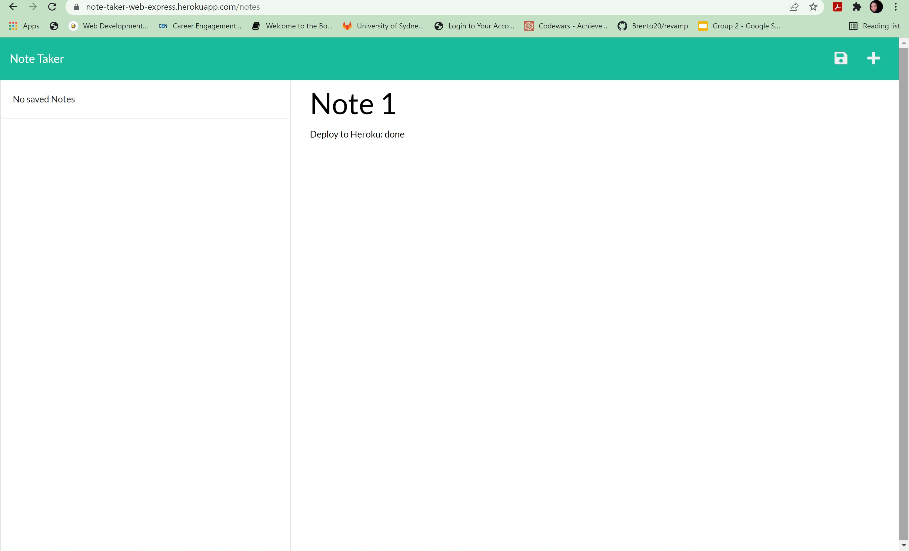

# Note Taker

## Description

The application is a Node.js and express application that allows the user to add and delete notes. Express.js is used for back end, while notes' data is saved and retreived from a JSON file.

## Installation

Please visit the application deployed link here: https://note-taker-web-express.herokuapp.com/

## Usage

Upon loading the homepage the user will be presented with a start button:  

  

After pressing the start button the notes page will load. Any previously saved notes are loaded into the sidebar, if any.   

When the user adds both a note title and note text the save button will be visible:  

The user can save multiple notes:  
  

A note can be deleted through pressing the delete button:  
  

Upon pressing a note from the side bar it is loaded into the main content area. In this case a new note can be added through pressing the plus icon on the rop right corner.  

